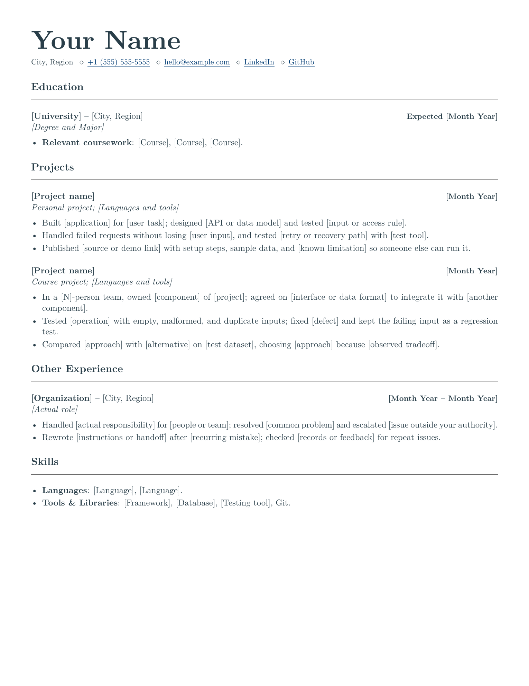
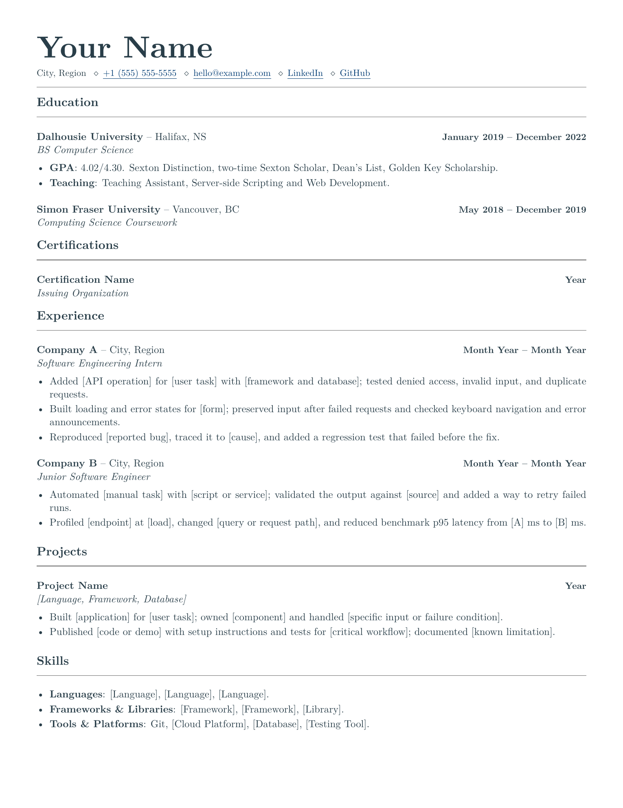
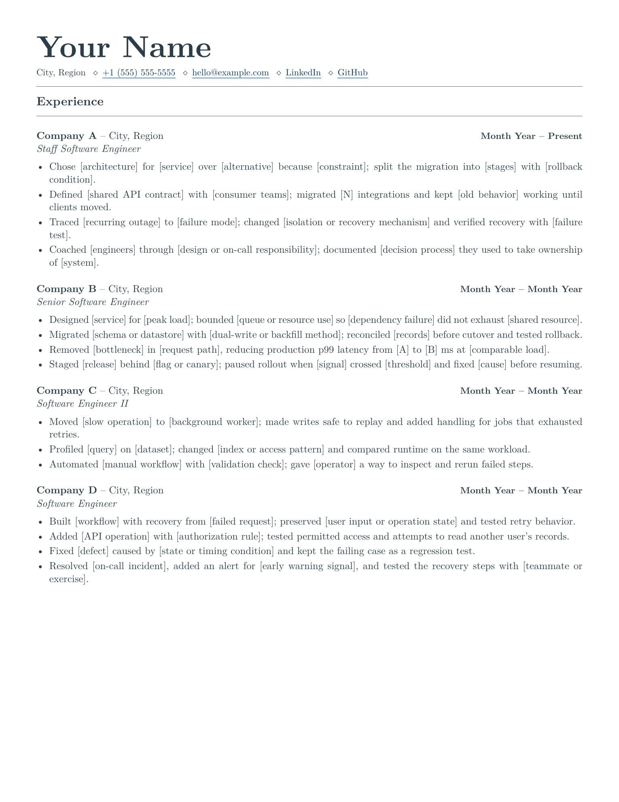
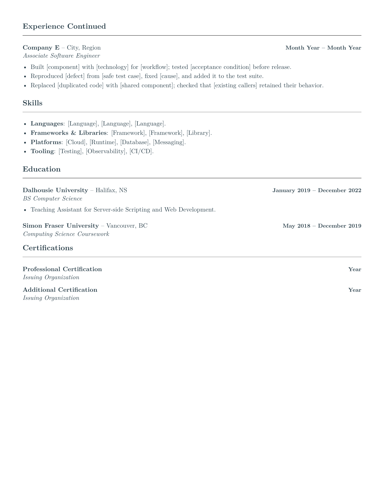

# LaTeX Software Engineering Resume Templates

[](https://github.com/deepdave98/swe-resume-templates/actions/workflows/build.yml)
[](LICENSE)

I made this to help software engineers spend less time on layout, design, fighting with latex and more time showing their work. Start with projects if you have no internship, use the new-grad version if you have relevant work, or choose the two-page experienced version. All three use the same style.

The example bullets reflect what I have looked for while hiring engineers: clear ownership, real constraints, and proof the work held up. Every software engineering employer, role, metric, and contact detail is a placeholder.

## Pick a Template

Edit in Overleaf with no local setup, or download a standalone ZIP. Both paths use the current templates.

| Template | Edit online | Download | Preview |
| --- | --- | --- | --- |
| No Internship (1 page) | [](https://www.overleaf.com/docs?snip_uri=https%3A%2F%2Fraw.githubusercontent.com%2Fdeepdave98%2Fswe-resume-templates%2Fmain%2Fdownloads%2Fno-internship-resume.zip&engine=xelatex&main_document=resume.tex) | [Starter ZIP](https://raw.githubusercontent.com/deepdave98/swe-resume-templates/main/downloads/no-internship-resume.zip) | [PDF](output/pdf/no-internship-resume.pdf) |
| New Grad (1 page) | [](https://www.overleaf.com/docs?snip_uri=https%3A%2F%2Fraw.githubusercontent.com%2Fdeepdave98%2Fswe-resume-templates%2Fmain%2Fdownloads%2Fnew-grad-resume.zip&engine=xelatex&main_document=resume.tex) | [Starter ZIP](https://raw.githubusercontent.com/deepdave98/swe-resume-templates/main/downloads/new-grad-resume.zip) | [PDF](output/pdf/new-grad-resume.pdf) |
| Experienced (2 pages) | [](https://www.overleaf.com/docs?snip_uri=https%3A%2F%2Fraw.githubusercontent.com%2Fdeepdave98%2Fswe-resume-templates%2Fmain%2Fdownloads%2Fexperienced-resume.zip&engine=xelatex&main_document=resume.tex) | [Starter ZIP](https://raw.githubusercontent.com/deepdave98/swe-resume-templates/main/downloads/experienced-resume.zip) | [PDF](output/pdf/experienced-resume.pdf) |

Open `resume.tex`. Replace the contact details, education, credentials, and example work with your own. Recompile, inspect every page, then download the PDF. The Overleaf buttons select XeLaTeX automatically.

No internship yet? Start with education and projects. Keep course projects labeled as projects, name the part you built, and delete **Other Experience** if it does not apply. You do not need an internship or a certification to fill a section.

Each ZIP contains `resume.tex`, `resume.cls`, `latexmkrc`, `START_HERE.md`, and `LICENSE`. Upload it to Overleaf, or extract it and run `latexmk resume.tex` inside its folder with a local TeX installation. The included config selects XeLaTeX; no repository clone is needed.

New grads usually lead with education; experienced engineers lead with relevant work. Read [why section order changes](docs/section-order.md), including when to move projects up, drop certifications, or use a second page.

## Previews

### No Internship

[](output/pdf/no-internship-resume.pdf)

### New Grad

[](output/pdf/new-grad-resume.pdf)

### Experienced

<p>
  <a href="output/pdf/experienced-resume.pdf"></a>
  <a href="output/pdf/experienced-resume.pdf"></a>
</p>

## Build Locally

Click **Use this template** at the top of the repository, or clone it. On macOS or Linux:

```bash
git clone https://github.com/deepdave98/swe-resume-templates.git
cd swe-resume-templates
make
```

`make` builds all three templates to `build/`. Use `make no-internship`, `make new-grad`, or `make experienced` to build one. Run `make preview` to refresh the published PDFs and PNGs.

On Windows, or without `make`, run `latexmk` from the repository root:

```bash
latexmk -xelatex -outdir=build/no-internship templates/no-internship-resume.tex
latexmk -xelatex -outdir=build/new-grad templates/new-grad-resume.tex
latexmk -xelatex -outdir=build/experienced templates/experienced-resume.tex
```

## Local Requirements

You need a TeX distribution with XeLaTeX, `latexmk`, and LaTeX 2020-10-01 or newer.

On macOS:

```bash
brew install --cask mactex-no-gui
```

On Ubuntu or Debian:

```bash
sudo apt update
sudo apt install latexmk texlive-xetex texlive-latex-extra
```

On Windows, install TeX Live or MiKTeX and make sure `latexmk` is on your `PATH`.

PNG previews require Poppler or ImageMagick. Edit shared styling in `resume.cls`.

## Edit the Content

### Contacts

Edit your email and phone once. Each command uses the same value for the visible text and clickable link:

```latex
\resumephone{+1 (416) 555-0123}
\resumeemail{alex_morgan+jobs@example.com}
```

Keep these inside `\resumecontact`. Use a literal email address; underscores, plus signs, and hyphens work. Phone numbers need `+`, the country code, and 7 to 15 digits total. Spaces, parentheses, hyphens, and periods are removed from the link, not the displayed number. No country code is guessed.

Unsupported formats warn and print without a link. For an extension, custom email syntax, or a different label, use `\resumelink{destination}{label}` and check both values. Remove a contact with its preceding `\contactsep` if you do not want it shown. Click every link in the downloaded PDF before sending.

### Entries

Entries use this format:

```latex
\jobentry[Optional summary]{Role}{Organization}{Location}{Dates}
```

Leave out the optional summary if you do not need it. Pass `{}` as the location to hide it. Add bullets inside `jobduties`:

```latex
\begin{jobduties}
  \item Built [thing] for [user], handled [constraint], and moved [measure] from [A] to [B].
\end{jobduties}
```

Long organization names and locations wrap beside the dates. Keep dates concise; do not shrink the font to force a heading onto one line. Unbroken text can still overflow: use a short label for a link instead of printing its full URL.

For A4, use `\documentclass[a4paper]{resume}`. Use `letterpaper` for US Letter. Recompile and inspect every page after changing paper size; line and page breaks can move.

Write what you built, how you built it, and what changed. Experienced bullets should also show scope, tradeoffs, and operational ownership. Use only numbers you can defend.

For role-specific prompts, see the [backend](examples/engineering-bullets.md#backend-engineering), [frontend](examples/engineering-bullets.md#frontend-engineering), and [data engineering](examples/engineering-bullets.md#data-engineering) examples for early-career and experienced engineers.

The [community examples](examples/community/README.md) pair a real bullet with a reviewed rewrite and explain what changed. No submissions have been accepted yet. [Submit your own](https://github.com/deepdave98/swe-resume-templates/issues/new?template=resume-example.yml), with private details removed. Nothing enters the index until its author approves the final wording and a reviewer completes the [checklist](examples/community/REVIEW.md). Choose a byline or Anonymous; GitHub submission history remains public.

Escape LaTeX's special characters when they appear as text: `\&`, `\%`, `\$`, `\#`, and `\_`.

## Placeholder Warnings

Recompile and open **View logs** in Overleaf (**Logs and output files** in the older editor). The class warns about sample contacts, known example fields, and remaining `[prompts]` in the header, entries, and bullet lists. Replace the flagged text or delete the unused entry, then recompile. Local builds show the same warnings.

Warnings do not change the PDF or stop compilation. They are reminders, not a final review: unmarked examples and text hidden inside custom commands can pass; literal square brackets may be flagged. Check your education, links, dates, and every claim before sending.

## Page-Limit Reminders

The one-page starters warn if your edits spill onto a second page. The experienced starter warns after two. Check **View logs** in Overleaf or your local compile log for `Page limit exceeded`.

The budget is near the top of `resume.tex`:

```latex
\resumepagelimit{1}
```

Cut less relevant content first. If the extra page earns its space, change the number; remove the line to disable the reminder. The check counts pages from the current build. It never shrinks text, changes spacing, or stops compilation.

If LaTeX asks you to rerun, recompile before checking length. Its temporary rerun pages are not counted by this reminder.

## Check Your PDF

After editing, download the PDF from Overleaf or build it locally. From the repository root:

```bash
python3 scripts/check_resume.py "path/to/your-resume.pdf" --max-pages 1
```

This checks for empty pages, extraction errors, and replacement, private-use, or control characters. Use `--max-pages 2` for a two-page limit, or omit it for no limit. It runs locally, uploads nothing, and does not print or save your resume text. The checker also works as a standalone script; it does not need the templates or test files.

You need Python 3.9+ and Poppler's `pdftotext` on `PATH`: `brew install python poppler` on macOS, or `sudo apt install python3 poppler-utils` on Ubuntu/Debian. On Windows, use `py -3` and add Poppler's `bin` directory to `PATH`. No pip packages.

A pass is not an ATS score or a content review. The check cannot verify layout, reading order, missing words, or your claims. Inspect every page and read the extracted text:

```bash
pdftotext -layout "path/to/your-resume.pdf" -
```

That command prints personal data. Review it locally; redact it before sharing an issue.

## Template Tests

```bash
make test
```

This builds all three templates and checks the built and published PDFs against reviewed text snapshots. Missing words, changed reading order, unmapped characters, and wrong page counts fail. It also checks ZIP freshness, compiles the exact downloads, tests placeholder and page-limit warnings, checks headings and contact-link targets, runs the personal PDF checker, and validates community review records. CI runs the same checks.

Read the [test guide](tests/README.md) for Windows commands, baseline updates, and what the check cannot catch.

## Project Structure

```text
.
├── .github/ISSUE_TEMPLATE/       # Bugs, ideas, and example submissions
├── .github/workflows/build.yml   # CI builds and PDF checks
├── assets/starter/               # Instructions and compiler config for ZIPs
├── docs/section-order.md         # What to put first, and why
├── downloads/                    # Current standalone starter ZIPs
├── examples/
│   ├── engineering-bullets.md    # Role-specific prompts
│   └── community/               # Submissions, review checklist, and accepted index
├── output/pdf/                   # Published PDFs
├── preview/                      # Published PNG previews
├── scripts/                      # PDF checks, starter downloads, and community records
├── templates/                    # Resume content
├── tests/                        # PDF, download, and compile-warning checks
├── CONTRIBUTING.md
├── Makefile
└── resume.cls                    # Shared styling and compile warnings
```

## Before Publishing Yours

Check the source for comments and placeholder contacts, links, employers, and metrics; then inspect the final PDF. LaTeX logs can contain source text and local paths, so review staged files before committing.

CI checks compilation, page counts, and extracted text. Inspect every rendered page before sharing your resume.

Read [CONTRIBUTING.md](CONTRIBUTING.md) to submit a fix or example. Report vulnerabilities [privately](https://github.com/deepdave98/swe-resume-templates/security/advisories/new).

## License

Released under the [MIT License](LICENSE). Feel free to adapt it for your own resume.
