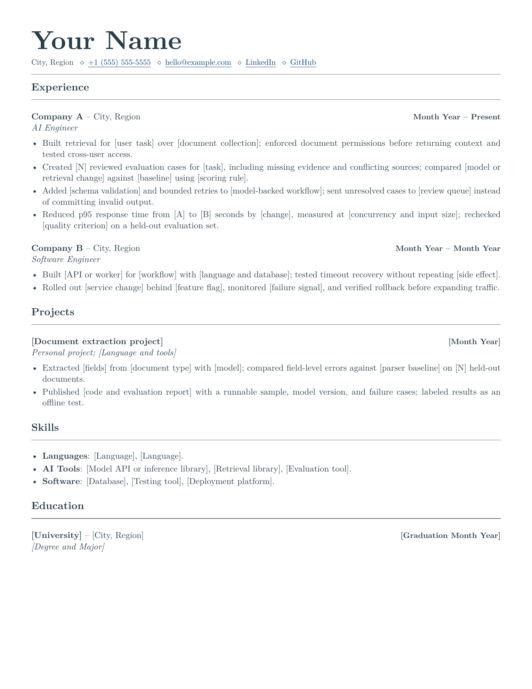
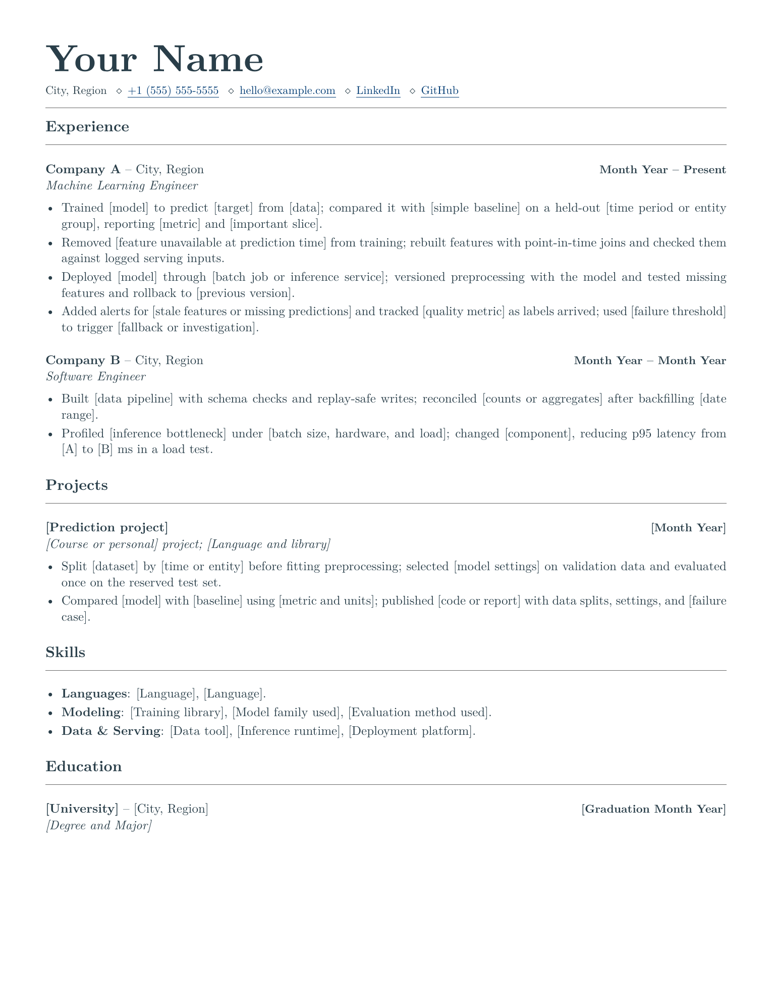

# LaTeX Software Engineering Resume Templates

[](https://github.com/deepdave98/swe-resume-templates/actions/workflows/build.yml)
[](LICENSE)

LaTeX resumes for software, AI, and ML engineers. Edit in Overleaf or build locally with XeLaTeX.

## Pick a Template

| Template | Edit online | Download | Preview |
| --- | --- | --- | --- |
| No Internship (1 page) | [](https://www.overleaf.com/docs?snip_uri=https%3A%2F%2Fraw.githubusercontent.com%2Fdeepdave98%2Fswe-resume-templates%2Fmain%2Fdownloads%2Fno-internship-resume.zip&engine=xelatex&main_document=resume.tex) | [Starter ZIP](https://raw.githubusercontent.com/deepdave98/swe-resume-templates/main/downloads/no-internship-resume.zip) | [PDF](output/pdf/no-internship-resume.pdf) |
| New Grad (1 page) | [](https://www.overleaf.com/docs?snip_uri=https%3A%2F%2Fraw.githubusercontent.com%2Fdeepdave98%2Fswe-resume-templates%2Fmain%2Fdownloads%2Fnew-grad-resume.zip&engine=xelatex&main_document=resume.tex) | [Starter ZIP](https://raw.githubusercontent.com/deepdave98/swe-resume-templates/main/downloads/new-grad-resume.zip) | [PDF](output/pdf/new-grad-resume.pdf) |
| Experienced (2 pages) | [](https://www.overleaf.com/docs?snip_uri=https%3A%2F%2Fraw.githubusercontent.com%2Fdeepdave98%2Fswe-resume-templates%2Fmain%2Fdownloads%2Fexperienced-resume.zip&engine=xelatex&main_document=resume.tex) | [Starter ZIP](https://raw.githubusercontent.com/deepdave98/swe-resume-templates/main/downloads/experienced-resume.zip) | [PDF](output/pdf/experienced-resume.pdf) |
| AI Engineer (1 page) | [](https://www.overleaf.com/docs?snip_uri=https%3A%2F%2Fraw.githubusercontent.com%2Fdeepdave98%2Fswe-resume-templates%2Fmain%2Fdownloads%2Fai-engineer-resume.zip&engine=xelatex&main_document=resume.tex) | [Starter ZIP](https://raw.githubusercontent.com/deepdave98/swe-resume-templates/main/downloads/ai-engineer-resume.zip) | [PDF](output/pdf/ai-engineer-resume.pdf) |
| ML Engineer (1 page) | [](https://www.overleaf.com/docs?snip_uri=https%3A%2F%2Fraw.githubusercontent.com%2Fdeepdave98%2Fswe-resume-templates%2Fmain%2Fdownloads%2Fml-engineer-resume.zip&engine=xelatex&main_document=resume.tex) | [Starter ZIP](https://raw.githubusercontent.com/deepdave98/swe-resume-templates/main/downloads/ml-engineer-resume.zip) | [PDF](output/pdf/ml-engineer-resume.pdf) |

The no-internship starter emphasizes projects; new grad leads with education; experienced with work. Use a second page only when relevant experience needs it. [Section order guide](docs/section-order.md).

AI Engineer covers applications built with models; ML Engineer covers model training and serving. Graduates can move education and projects first. [AI/ML guide](docs/ai-ml-resumes.md).

<details>
<summary>View all previews</summary>

### No Internship

[](output/pdf/no-internship-resume.pdf)

### New Grad

[](output/pdf/new-grad-resume.pdf)

### Experienced

<p>
  <a href="output/pdf/experienced-resume.pdf"></a>
  <a href="output/pdf/experienced-resume.pdf"></a>
</p>

### AI and ML Engineering

<p>
  <a href="output/pdf/ai-engineer-resume.pdf"></a>
  <a href="output/pdf/ml-engineer-resume.pdf"></a>
</p>

</details>

## Edit the Content

1. Open a template in Overleaf. If uploading a ZIP manually, select **XeLaTeX** and `resume.tex` as the main document.
2. Edit `resume.tex`. Replace contacts, education, credentials, and sample work. Delete entries that do not apply.
3. Recompile. Check **View logs** for placeholders or extra pages, then inspect the PDF and test its links.

Warnings can miss unfinished content; they do not verify your claims. Before publishing source, check comments and logs for private details too.

Escape literal LaTeX characters: `\&`, `\%`, `\$`, `\#`, `\_`. Edit styling in `resume.cls`. See the [editing reference](docs/editing.md) for contacts, entries, A4, and page limits.

Bullet examples: [Backend](examples/engineering-bullets.md#backend-engineering) · [Frontend](examples/engineering-bullets.md#frontend-engineering) · [Data](examples/engineering-bullets.md#data-engineering) · [AI and ML](docs/ai-ml-resumes.md#bullet-prompts). Describe your contribution and how you checked it; use numbers only when you can explain the measurement.

## Build Locally

Install [XeLaTeX and latexmk](docs/local-setup.md), extract a starter ZIP, and run inside its folder:

```bash
latexmk resume.tex
```

The included config selects XeLaTeX and writes `resume.pdf`. No clone needed.

In a clone, `make` builds all five starters to `build/`; `make new-grad` builds one. [All targets and Windows commands](docs/local-setup.md#build-from-a-clone).

## Check Your PDF

[Download the PDF reviewer](https://raw.githubusercontent.com/deepdave98/swe-resume-templates/main/downloads/pdf-review.zip). Unzip it, open `pdf-review.html` in your browser, and choose your finished PDF.

Compare pages with extracted text, inspect link destinations, and copy text into application forms. Known sample contacts get a warning. Processing stays in your browser; the download works offline.

Limit: 20 MB and 20 pages. No OCR or ATS score. [Review limits and privacy](tools/pdf-review/README.md) · [Terminal checker](tests/README.md#check-your-own-resume).

## Tailor Without Duplicating

The optional [shared-content project](examples/application-versions/README.md) keeps facts in one place and selects different bullets for backend, frontend, and infrastructure applications. Edit a shared date once, then recompile each version.

[Open in Overleaf](https://www.overleaf.com/docs?snip_uri=https%3A%2F%2Fraw.githubusercontent.com%2Fdeepdave98%2Fswe-resume-templates%2Fmain%2Fdownloads%2Fapplication-versions.zip&engine=xelatex&main_document=backend.tex) · [ZIP](https://raw.githubusercontent.com/deepdave98/swe-resume-templates/main/downloads/application-versions.zip) · PDFs: [backend](output/pdf/application-backend.pdf), [frontend](output/pdf/application-frontend.pdf), [infrastructure](output/pdf/application-infrastructure.pdf).

Send the PDF, not the ZIP: the source includes unselected work.

## Contribute

[Submit a fix](CONTRIBUTING.md) or [a bullet for review](https://github.com/deepdave98/swe-resume-templates/issues/new?template=resume-example.yml). Remove private details first. Publication needs your approval; an anonymous byline does not hide your GitHub account. [Community examples](examples/community/README.md).

Run `make test` before submitting code or template changes. [Test setup and coverage](tests/README.md).

[MIT License](LICENSE) · [Report a security issue privately](https://github.com/deepdave98/swe-resume-templates/security/advisories/new).
